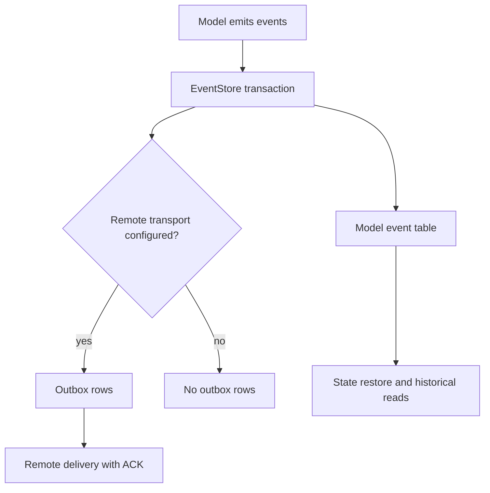
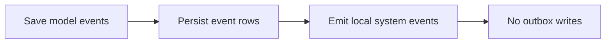
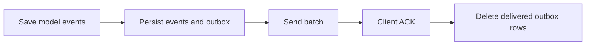
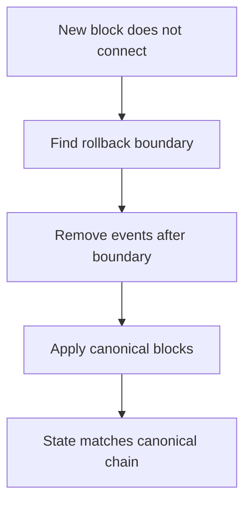

# EventStore

EventStore is the persistence layer for model changes.

When your model emits events, EasyLayer stores them and reconstructs state from them. This is why the framework can restore models, query historical state, and support reorg-aware workflows.

## Runtime flow

The important point: model events are the source of truth for the model state.

## What gets stored

Each persisted event contains the data needed to rebuild state:

| Field | Why it matters |
|---|---|
| aggregate/model id | Which model instance owns the event. |
| event type | Which reducer should apply it. |
| payload | The domain change. |
| version/sequence | Ordering inside the model. |
| block height | Historical state and rollback boundary. |
| request id | Traceability through a write flow. |
| timestamp | Operational inspection. |

## Local-only vs remote delivery

EasyLayer can run with no remote transport configured. This is useful for tests, embedded runtimes, desktop/browser experiments, or services that only need local processing.

In local-only mode:

When a remote transport is configured:

This avoids fake delivery. If there is no remote transport, EasyLayer does not pretend that remote delivery happened.

## Historical reads

Because model state is built from events, the framework can restore state at a block height that has already been processed.

Typical use cases:

- show what a tracked balance was at a previous block;
- debug why a model reached a certain state;
- replay a model after changing infrastructure;
- inspect event history for audits.

## Reorg-aware workflow

A blockchain reorganization means previously accepted blocks are no longer canonical.

The high-level workflow is:

The exact behavior depends on the crawler package, network, provider data, and configured start/checkpoint state. Public docs should describe this as a runtime capability, not as an unmeasured production guarantee.

## Storage backends

| Backend | Best for |
|---|---|
| SQLite | Local development, tests, smaller self-hosted services, desktop-style deployments. |
| PostgreSQL | Production services, stronger operational tooling, larger event histories, concurrent access. |
| Browser/IndexedDB-backed runtime | Browser or desktop flows where server-side storage is not the target. |

Use package-specific docs for exact environment variables and version-specific setup.

## Design rule

Do not design the EventStore as a generic full-chain database unless the product really needs that. The EventStore should persist the events required to rebuild your models.

For large analytical datasets, use a dedicated projection/read-model strategy rather than turning every live model into a warehouse.

## Related

- [State Models](/docs/data-modeling)
- [Transport Layer](/docs/transport-layer)
- [System Models](/docs/system-models)
