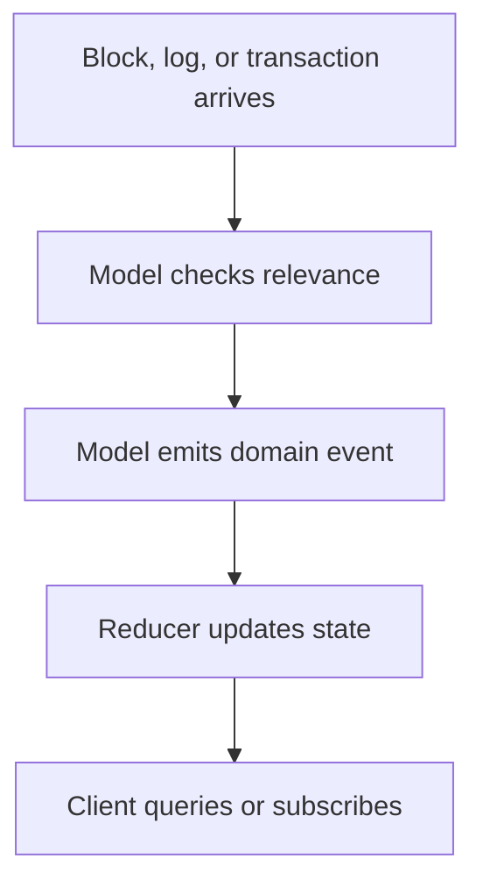

# First Custom Model

A first custom model should be small, testable, and directly connected to product value.

The goal is not to prove that you can parse every block. The goal is to prove that EasyLayer can maintain the state your product needs.

## Model planning worksheet

Fill this in before coding:

| Question | Example answer |
|---|---|
| What state do we need? | Current activity for one contract. |
| What raw data changes it? | EVM logs from that contract. |
| What event should the model emit? | `ContractEventObserved`. |
| What state should the reducer update? | `totalEvents`, `lastEventBlock`, `recentEvents`. |
| How will the app read it? | HTTP query or WebSocket subscription. |
| How do we know it worked? | Query returns expected state after a known block range. |

## Minimal model flow



## Keep the first version narrow

Good first scope:

- one contract address;
- one event signature;
- one wallet list;
- one block range;
- one query;
- one transport.

Bad first scope:

- every contract;
- every address;
- every chain;
- multiple transports;
- full historical analytics;
- exact performance claims before measurement.

## Example shape

This is a conceptual shape. Use package-specific docs for the exact current API.

```ts
const ContractStateModel = {
  modelId: 'contract-state',
  state: {
    totalEvents: 0,
    lastBlock: null,
  },
  sources: {
    async log(ctx) {
      if (ctx.log.address !== TARGET_CONTRACT) return;
      return {
        transactionHash: ctx.log.transactionHash,
        blockNumber: ctx.log.blockNumber,
      };
    },
    async block(ctx) {
      const matched = ctx.locals.log ?? [];
      if (matched.length > 0) {
        ctx.applyEvent('ContractEventsObserved', ctx.blockNumber, { matched });
      }
    },
  },
  reducers: {
    ContractEventsObserved(state, event) {
      state.totalEvents += event.payload.matched.length;
      state.lastBlock = event.blockHeight;
    },
  },
};
```

## What to verify

After implementation, verify:

- the model emits events only for relevant data;
- EventStore contains the expected events;
- state restores after restart;
- the selected query returns the expected state;
- live events reach the selected transport;
- unrelated blockchain data is not stored just because it exists.

## Related

- [State Models](/docs/data-modeling)
- [EventStore](/docs/event-store)
- [Network Providers](/docs/network-providers)
