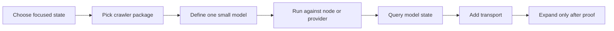
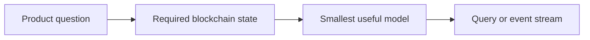
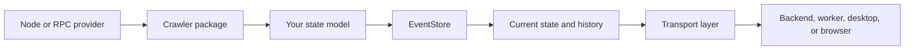

# Start Here

EasyLayer is for building **focused blockchain state services**, not for copying an entire blockchain into your application database.

Use it when your product needs to keep one piece of blockchain state live: one smart contract, a wallet set, UTXOs for selected addresses, fee statistics, protocol-specific events, or another narrow state model.

The framework gives you the runtime around that model: block fetching, event persistence, state reconstruction, reorg-aware workflows, queries, live event delivery, and multiple transports.

## What to do first

Follow this path before reading the versioned package pages.

## Step 1: define the state, not the dataset

Start with one concrete question:

Good first targets:

| Product need | First EasyLayer model |
|---|---|
| Monitor one EVM smart contract | Contract event model |
| Track selected wallets | Wallet balance or activity model |
| Build a Bitcoin wallet app | Focused UTXO or balance model |
| Show live block progress | Network/system model subscription |
| Feed another service | Event stream over WebSocket, HTTP webhook, or IPC |
| Desktop/browser integration | Electron IPC or SharedWorker transport |

Avoid starting with “index the whole chain” unless the whole chain is truly your product.

## Step 2: choose the package

| Package | Use it for |
|---|---|
| `@easylayer/bitcoin-crawler` | Bitcoin and Bitcoin-like UTXO chains |
| `@easylayer/evm-crawler` | Ethereum-style chains and EVM-compatible networks |
| `@easylayer/transport-sdk` | Client access through HTTP, WebSocket, IPC, Electron IPC, or browser transport |

The package-specific pages under **Get Started** contain versioned setup details. This Overview section explains the system and the decision path.

## Step 3: understand the runtime shape

The important part is the model boundary. Your model decides what becomes application state. EasyLayer does not force your database to store unrelated blocks, transactions, or logs if your product only needs a focused subset.

## Step 4: build one small model

A first model should be intentionally narrow:

- one contract address;
- a short wallet allowlist;
- one event type;
- one simple state object;
- one query that proves the state is useful.

Do not begin with every address, every transfer, or a complete analytics warehouse. If that is the final goal, first prove the small model and then design a read-model/projection path.

## Step 5: choose the transport after the model works

| Environment | Transport to start with |
|---|---|
| Backend service | HTTP or WebSocket |
| Service that needs live events | WebSocket or HTTP webhook |
| Node process pair | IPC parent/child |
| Desktop app | Electron IPC |
| Browser extension or SPA runtime | SharedWorker/browser transport |

The transport is integration infrastructure. It should not decide your state model. Define the state first, then expose it.

## Step 6: use the component pages

Read these pages in order:

1. [When to Use EasyLayer](/docs/when-to-use) — decide whether the framework fits.
2. [State Models](/docs/data-modeling) — understand what you build.
3. [EventStore](/docs/event-store) — understand persistence, history, and recovery.
4. [Network Providers](/docs/network-providers) — connect to a node or RPC provider.
5. [Transport Layer](/docs/transport-layer) — connect your application.

Then use the versioned package docs under **Get Started** for exact installation and configuration details.

## What not to do first

Do not start by adding many packages, networks, transports, and large models at once.

Do not design the database as if you must store the whole blockchain. EasyLayer’s main value is that your application can keep the focused state it actually needs.

Do not treat transports as the product. They are the access layer for a state service.

## Next step

If you are still deciding whether EasyLayer fits, read [When to Use EasyLayer](/docs/when-to-use).

If the fit is clear, open the package-specific docs for your chain under **Get Started**.
