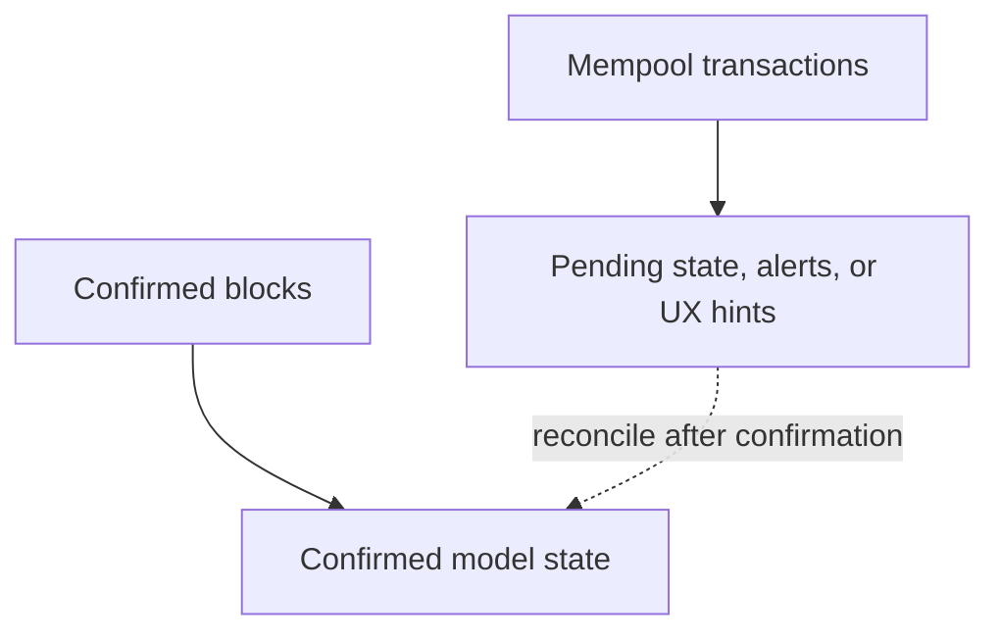

# Mempool Monitoring

Mempool monitoring is for pending transactions. It is optional.

Use it when the product needs to react before transactions are confirmed. Do not enable it just because it exists.

## When to use it

Good use cases:

- wallet UX that shows pending incoming/outgoing transactions;
- fee or congestion monitoring;
- alerting for pending contract interactions;
- pre-confirmation risk checks;
- dashboards that separate pending and confirmed activity.

Not a good use case:

- building confirmed historical state;
- replacing block processing;
- making final business decisions before confirmation without a risk policy.

## Confirmed state vs pending state

Keep these concepts separate in your model. A pending transaction can disappear, be replaced, or confirm differently than expected.

## Model design

A mempool-aware model should usually keep two state areas:

| State area | Meaning |
|---|---|
| confirmed | State produced by canonical blocks. |
| pending | Temporary observations from mempool data. |

When a transaction confirms, the confirmed block flow should update the confirmed state. The pending state can then be cleared or reconciled.

## Provider dependency

Mempool support depends on the network and provider. Some providers expose enough pending transaction data; others limit or omit it.

Before building around mempool data, verify:

- whether the provider exposes the needed fields;
- how often data can be polled/streamed;
- whether rate limits allow the workflow;
- how replacements/drops are represented.

## Related

- [Network Providers](/docs/network-providers)
- [System Models](/docs/system-models)
- [State Models](/docs/data-modeling)
