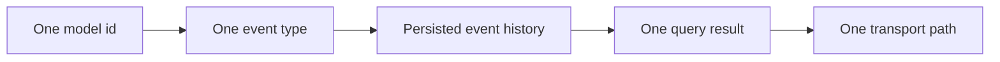

# Quickstart Path

This page exists for direct CTA links. The main Overview entry point is [Start Here](/docs/).

Use this page when you already know which chain you want to test and need the shortest path to a working evaluation.

## 1. Pick the first runtime

| Chain/runtime | Package docs |
|---|---|
| Bitcoin / UTXO chains | [Bitcoin Crawler](/docs/get-started/bitcoin-crawler) |
| EVM-compatible chains | [EVM Crawler](/docs/get-started/evm-crawler) |
| Client integration | [Transport SDK](/docs/get-started/transport-sdk) |

## 2. Pick one model target

Choose one:

- one smart contract;
- one wallet allowlist;
- one UTXO/address subset;
- one system/network event stream;
- one small fee or block statistic.

Do not start with full-chain indexing unless that is the actual proof.

## 3. Run a narrow proof

Your first proof should produce:

That is enough to verify the architecture.

## 4. Inspect the result

Check:

- the crawler starts;
- the provider connection works;
- model events are stored;
- the model state can be queried;
- the chosen transport works;
- the database grows according to the focused model, not unrelated chain data.

## 5. Expand only after proof

After the small model works, decide whether to add:

- more addresses/contracts;
- historical replay from an earlier start height;
- another transport;
- custom queries;
- mempool monitoring;
- a larger storage/projection strategy.

## Next

- [State Models](/docs/data-modeling)
- [EventStore](/docs/event-store)
- [Transport Layer](/docs/transport-layer)
