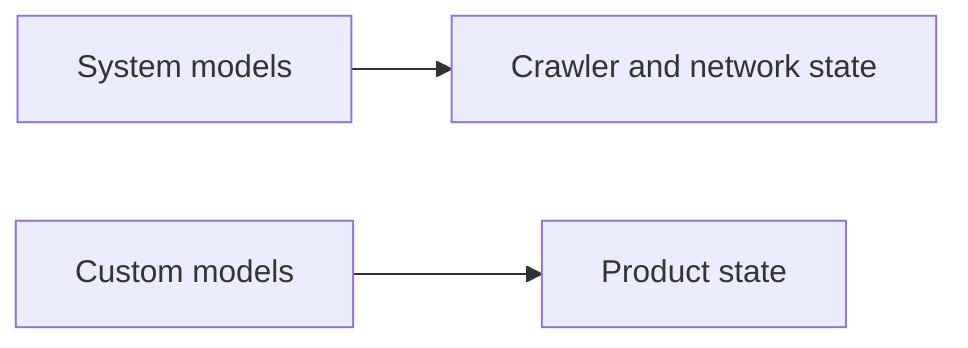
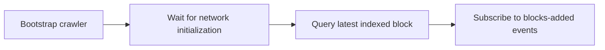

# System Models

System models are built-in models that describe the crawler/runtime itself.

They are useful even before you write a custom model because they can show whether the crawler is connected, initialized, and processing blocks.

## What they are for

Use system models to answer operational questions:

| Question | System-model use |
|---|---|
| Has the crawler initialized? | Subscribe to initialization events. |
| Which block is the crawler at? | Query network state or latest block. |
| Did new blocks arrive? | Subscribe to blocks-added events. |
| Did a reorg happen? | Subscribe to network/reorg events where supported. |
| Is the service healthy? | Use network state in a health/monitoring endpoint. |

## How they fit with custom models

Do not put product logic into a system model. Use system models for runtime visibility and custom models for application state.

## Common first use

A first evaluation can start with only system models:

This proves the runtime and provider connection before you add product-specific state.

## Event examples

Exact event names differ by package and version. Common categories are:

| Event category | Meaning |
|---|---|
| network initialized | The crawler created/restored network state. |
| blocks added | New canonical blocks were processed. |
| reorg detected/resolved | The crawler adjusted state after chain reorganization. |
| mempool refreshed | Pending transaction state changed, when mempool monitoring is enabled. |

Use package-specific docs for current event names.

## Query examples

Common query categories:

- get current network model;
- get latest indexed block;
- fetch network/system events;
- get sync/progress state where exposed by the package.

System model queries are often the first thing to wire into dashboards, health checks, or tests.

## Related

- [Network Providers](/docs/network-providers)
- [Transport Layer](/docs/transport-layer)
- [Mempool Monitoring](/docs/mempool-monitoring)
