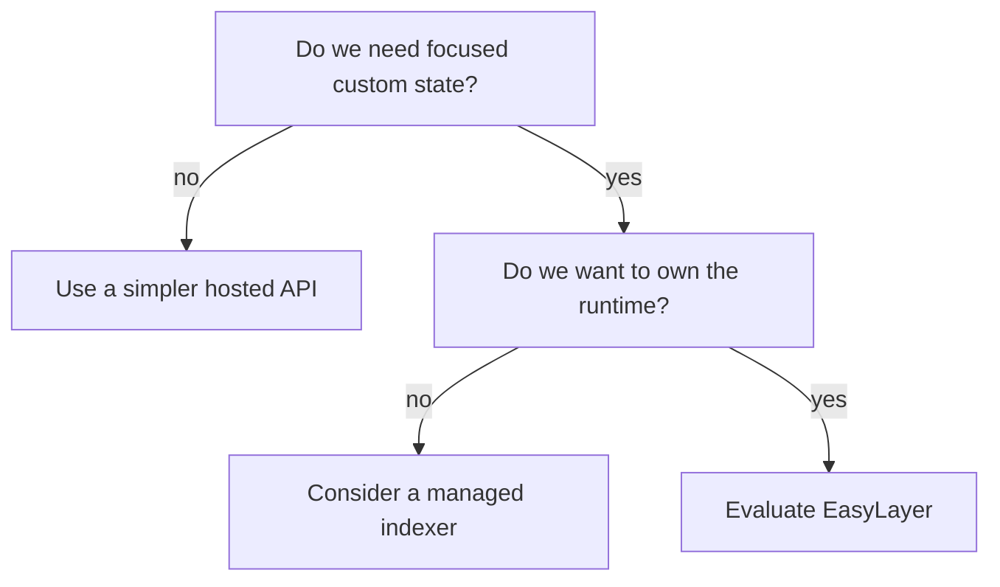

# EasyLayer vs Alternatives

This page compares categories of solutions. Specific competitor capabilities can change, so avoid relying on old claims without checking current official docs.

## Options

| Option | Best when | Main trade-off |
|---|---|---|
| Hosted blockchain API | You need simple lookups quickly. | Less control over state, runtime, and cost shape. |
| Managed indexing platform | Your use case fits its indexing model and hosting assumptions. | Schema/runtime constraints and platform dependency. |
| Build your own indexer | You need full control and have time to build everything. | You own reorgs, persistence, transports, replay, tests, and operations. |
| EasyLayer | You need focused custom state with self-hosted control. | You still operate a runtime and must validate the framework for your use case. |

## Where EasyLayer is strongest

EasyLayer is strongest when the product needs its own blockchain state service:

- monitor one smart contract instead of storing all chain activity;
- track a selected wallet set instead of every wallet;
- maintain a focused UTXO view;
- expose state to backend, desktop, browser, or process-local consumers;
- use event history and reorg-aware architecture instead of ad-hoc scripts;
- keep data and runtime under your control.

## Where a hosted API is better

Use a hosted API when:

- you only need a standard lookup;
- you do not need custom state;
- you do not want to operate anything;
- latency/cost limits are acceptable;
- provider lock-in is not a problem for this stage.

## Where a managed indexer is better

Use a managed indexer when:

- your target chain/protocol is already well supported;
- the platform schema fits your needs;
- hosted operation is acceptable;
- the fastest path matters more than owning the runtime.

## Where building internally is better

Build internally when:

- your requirements are unique enough that a framework would fight you;
- you need complete control over every runtime detail;
- your team can own reorg handling, storage, transports, tests, and operations;
- the cost of building the platform is justified.

## Decision rule

Choose EasyLayer when this sentence is true:

If the product only needs a generic answer from a blockchain API, start simpler.

## Related

- [When to Use EasyLayer](/docs/when-to-use)
- [State Models](/docs/data-modeling)
- [EventStore](/docs/event-store)
